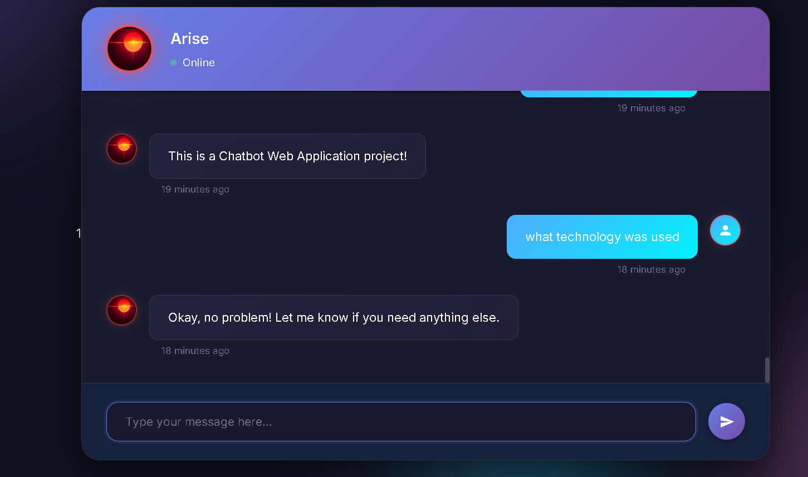

# 🤖 Chatbot Web Application

A complete, modern chatbot web application built with **Node.js**, **Express.js**, **EJS**, and **MongoDB**. This project features a rule-based chatbot with a beautiful, responsive UI and RESTful API architecture.


## ✨ Features

### Frontend
- 🎨 **Modern UI Design** with gradient backgrounds and smooth animations
- 📱 **Fully Responsive** - works on desktop, tablet, and mobile
- 💬 **Real-time Chat Interface** with typing indicators
- 🌙 **Dark Theme** with glassmorphism effects
- ⚡ **Dynamic Updates** without page reload

### Backend
- 🏗️ **MVC Architecture** (Model-View-Controller)
- 🔄 **RESTful API** design
- 🗄️ **MongoDB Integration** with Mongoose ODM
- 🛡️ **Input Validation** middleware
- 📝 **Request Logging** with Morgan
- ⚠️ **Centralized Error Handling**

### Chatbot
- 🧠 **Rule-based Processing** with keyword matching
- 💾 **Persistent Storage** of conversations
- 🎯 **Customizable Responses** via admin API
- 📊 **Chat History** retrieval
- 🔍 **Case-insensitive** keyword matching

## 📁 Project Structure

```
chatbot-web-application/
├── app.js                      # Main application entry point
├── package.json                # Project dependencies
├── .env                        # Environment variables
├── README.md                   # Project documentation
│
├── controllers/                # Business logic
│   ├── chatController.js       # Chat message processing
│   └── adminController.js      # Admin intent management
│
├── models/                     # Database schemas
│   ├── Chat.js                 # Chat message schema
│   └── Intent.js               # Chatbot intent schema
│
├── routes/                     # API endpoints
│   ├── chatRoutes.js           # Chat API routes
│   ├── adminRoutes.js          # Admin API routes
│   └── viewRoutes.js           # View rendering routes
│
├── middlewares/                # Custom middleware
│   ├── errorHandler.js         # Error handling
│   ├── logger.js               # Request logging
│   └── validator.js            # Input validation
│
├── views/                      # EJS templates
│   └── index.ejs               # Main chatbot interface
│
└── public/                     # Static files
    ├── css/
    │   └── style.css           # Application styles
    └── js/
        └── app.js              # Frontend JavaScript
```

## 🚀 Getting Started

### Prerequisites

- **Node.js** (v14 or higher)
- **MongoDB** (local or cloud instance)
- **npm** or **yarn**

### Installation

1. **Clone the repository**
   ```bash
   git clone <repository-url>
   cd chatbot-web-application
   ```

2. **Install dependencies**
   ```bash
   npm install
   ```

3. **Configure environment variables**
   
   Edit the `.env` file:
   ```env
   PORT=3000
   MONGODB_URI=mongodb://localhost:27017/chatbot_db
   NODE_ENV=development
   ```

4. **Start MongoDB**
   
   Make sure MongoDB is running on your system:
   ```bash
   # For Windows (if installed as service)
   net start MongoDB
   
   # For macOS/Linux
   sudo systemctl start mongod
   ```

5. **Run the application**
   
   **Development mode** (with auto-reload):
   ```bash
   npm run dev
   ```
   
   **Production mode**:
   ```bash
   npm start
   ```

6. **Open your browser**
   
   Navigate to: `http://localhost:3000`

## 🔌 API Endpoints

### Chat API

#### POST `/api/chat`
Send a message to the chatbot

**Request:**
```json
{
  "message": "Hello"
}
```

**Response:**
```json
{
  "success": true,
  "data": {
    "userMessage": "Hello",
    "botReply": "Hello! How can I help you today?",
    "timestamp": "2024-01-20T10:30:00.000Z"
  }
}
```

#### GET `/api/chat/history`
Retrieve chat conversation history

**Query Parameters:**
- `limit` (optional): Number of messages to retrieve (default: 50)
- `skip` (optional): Number of messages to skip (default: 0)

**Response:**
```json
{
  "success": true,
  "data": {
    "chats": [...],
    "total": 100,
    "limit": 50,
    "skip": 0
  }
}
```

### Admin API

#### POST `/api/admin/intent`
Add a new chatbot intent (keyword-response pair)

**Request:**
```json
{
  "keyword": "weather",
  "response": "I don't have real-time weather data, but I hope it's nice!"
}
```

**Response:**
```json
{
  "success": true,
  "data": {
    "intent": {
      "_id": "...",
      "keyword": "weather",
      "response": "I don't have real-time weather data, but I hope it's nice!",
      "createdAt": "2024-01-20T10:30:00.000Z"
    }
  },
  "message": "Intent added successfully"
}
```

#### GET `/api/admin/intents`
Get all chatbot intents

**Response:**
```json
{
  "success": true,
  "data": {
    "intents": [...],
    "total": 15
  }
}
```

#### DELETE `/api/admin/intent/:id`
Delete a specific intent

**Response:**
```json
{
  "success": true,
  "message": "Intent deleted successfully"
}
```

## 🗄️ Database Schema

### Chat Collection
```javascript
{
  userMessage: String,      // User's message
  botReply: String,         // Bot's response
  timestamp: Date           // Message timestamp
}
```

### Intent Collection
```javascript
{
  keyword: String,          // Keyword to match (lowercase)
  response: String,         // Bot's response
  createdAt: Date          // Creation timestamp
}
```

## 🎨 Customization

### Adding New Intents

You can add new chatbot responses by:

1. **Using the API:**
   ```bash
   curl -X POST http://localhost:3000/api/admin/intent \
     -H "Content-Type: application/json" \
     -d '{"keyword":"your-keyword","response":"Your response"}'
   ```

2. **Directly in MongoDB:**
   ```javascript
   db.intents.insertOne({
     keyword: "your-keyword",
     response: "Your response",
     createdAt: new Date()
   })
   ```

### Modifying the UI

- **Colors & Theme:** Edit CSS variables in `public/css/style.css`
- **Layout:** Modify `views/index.ejs`
- **Animations:** Adjust keyframes in `public/css/style.css`

## 🛠️ Technologies Used

### Backend
- **Node.js** - JavaScript runtime
- **Express.js** - Web framework
- **EJS** - Template engine
- **MongoDB** - NoSQL database
- **Mongoose** - MongoDB ODM
- **Morgan** - HTTP request logger
- **dotenv** - Environment variable management

### Frontend
- **HTML5** - Markup
- **CSS3** - Styling with modern features
- **Vanilla JavaScript** - Client-side logic
- **Google Fonts (Inter)** - Typography

## 📝 Sample Intents

The application comes pre-loaded with these sample intents:

- Greetings: hello, hi, hey
- Farewells: bye, goodbye
- Gratitude: thanks, thank you
- Questions: how are you, what is your name, what can you do
- General: help, weather, time, joke

## 🔒 Security Features

- ✅ Input validation middleware
- ✅ XSS prevention with HTML escaping
- ✅ Error handling without exposing stack traces (production)
- ✅ Request logging for monitoring

## 🐛 Troubleshooting

### MongoDB Connection Error
```
Error: MongoDB connection error
```
**Solution:** Ensure MongoDB is running and the connection URI in `.env` is correct.

### Port Already in Use
```
Error: Port 3000 is already in use
```
**Solution:** Change the PORT in `.env` file or stop the process using port 3000.

### Module Not Found
```
Error: Cannot find module 'express'
```
**Solution:** Run `npm install` to install all dependencies.

## 📚 Learning Resources

This project demonstrates:
- RESTful API design
- MVC architecture pattern
- MongoDB integration
- Middleware implementation
- Error handling best practices
- Frontend-backend communication
- Responsive web design

## 🤝 Contributing

This is a student project. Feel free to fork and modify for your own learning!

## 📄 License

ISC License - Free to use for educational purposes

## 👨‍💻 Author

Created as a full-stack web development project

---

**⭐ If you found this project helpful, please give it a star!**

### chatbot 

